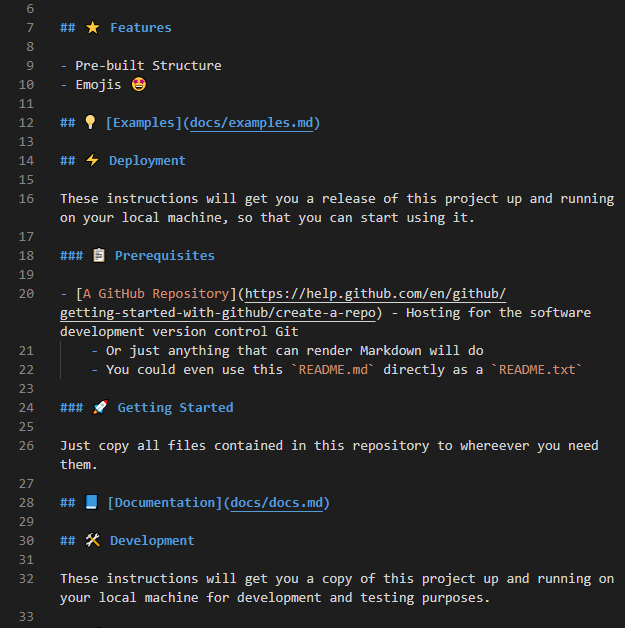

# 📄 template-README

Template for creating READMEs

## ⭐ Features

- Pre-built Structure
- Emojis 🤩

## 💡 [Examples](docs/examples.md)

## ⚡ Deployment

These instructions will get you a release of this project up and running on your local machine, so that you can start using it.

### 📋 Prerequisites

- [A GitHub Repository](https://help.github.com/en/github/getting-started-with-github/create-a-repo) - Hosting for the software development version control Git
    - Or just anything that can render Markdown will do
    - You could even use this `README.md` directly as a `README.txt`

### 🚀 Getting Started

Just copy all files contained in this repository to whereever you need them.

## 📘 [Documentation](docs/docs.md)

## 🛠️ Development

These instructions will get you a copy of this project up and running on your local machine for development and testing purposes.

### 📋 Prerequisites

- [Visual Studio Code](https://code.visualstudio.com/)
    - Or just any text editor, which supports syntax highlighting for Markdown
    - You could even use one without syntax highlighting

### 🚀 Getting Started

1. Get a copy of this repository
    - Either by clicking the `Use this template` button next to the `Clone or download` button and creating a new GitHub repository based on this template
    - Or by clicking the `Clone or download` button and then cloning or just simply downloading the repository
1. Start editing the repository contents
    - Either by opening up this `README.md` in your text editor - or, even better, open the whole folder into which you cloned or downloaded this repository
    - Or - if you're using a GitHub repository - by making the changes directly in the web interface, after you created your own repository based on this template
1. Rename the `LICENSE` file, so it's clear that is the license for this original repository and keep it in your repository
    - E.g. name it `LICENSE-template-README`
1. Add your own `LICENSE` file
1. Change the title (`#`) according to your project name and choose a fitting emoji to add to it
1. Take a screenshot from your project in action and replace `docs/images/usage.png` with it
1. Edit the section as you need
1. Add documentation and examples to `docs/`, if needed
    - Otherwise remove `docs/docs.md` and `docs/examples.md`, as well as the relevant sections
1. Remove other sections you don't need
1. Remove emojis from 3rd-level sections (`###`), if they are too close together (= not a lot of content in the sections) to avoid them getting too distracting

### 🐞 Troubleshooting

#### Something is not working
Do this thing to fix it.

## 🧰 Built With

### 📚 Resources

- [EmojiKeyboard](https://emojikeyboard.top/) - Get Emoji by Copy & Paste

### 🏛️ Libraries

- [Library that was used]() - Short description of the library

## 👨‍💻 Authors

- **Robin Hartmann** - [robin-hartmann](https://github.com/robin-hartmann)
    - *Entire Template*

## 📃 License

This project is licensed under the MIT License - see the [LICENSE](LICENSE) file for details.

## 👍 Acknowledgments

- Special thanks to anyone you want to thank and similar things